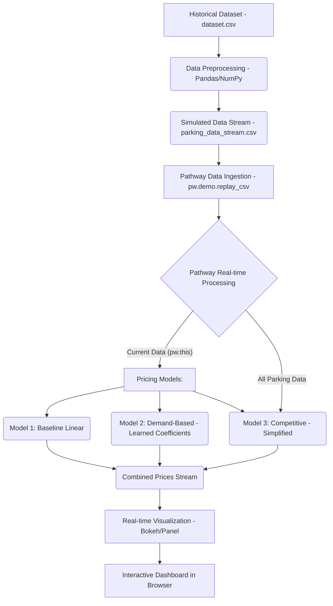

# ParkWay: Real-Time Dynamic Pricing for Urban Parking Lots

## 📄 Overview

**ParkWay** is a real-time dynamic pricing engine for urban parking lots, developed as a capstone project for **Summer Analytics 2025 by IIT Guwahati**. The project addresses the challenges of static pricing—such as overutilization and underutilization—by dynamically adjusting parking prices based on real-time factors like occupancy, traffic, queue length, vehicle type, and special days.

Using a data-driven pipeline powered by **Pathway** and visualized via **Bokeh** and **Panel**, SmartPark implements and compares multiple pricing models to ensure efficient space utilization and fair dynamic pricing.

---

## 🎯 Objectives

- Build a dynamic pricing engine to adjust rates for multiple parking spaces in real-time.
- Implement models from scratch using core data science libraries like NumPy and Pandas.
- Use a real-time data streaming framework (**Pathway**) to simulate and process live data.
- Provide real-time interactive dashboards using **Bokeh** and **Panel** to visualize pricing behavior.

---

## 🛠️ Tech Stack

| Tool / Library    | Purpose |
|-------------------|---------|
| **Python**        | Programming language |
| **NumPy**         | Numerical computations, linear regression |
| **Pandas**        | Data manipulation & preprocessing |
| **Pathway**       | Real-time data stream processing |
| **Bokeh**         | Real-time interactive visualizations |
| **Panel**         | Interactive dashboard layout |
| **Google Colab**  | Development environment |

---

##  Architecture Diagram (Mermaid)

---

##  Workflow Breakdown

### 1. Data Ingestion & Preprocessing
- Start with `dataset.csv` containing historical parking lot data.
- Use Pandas to:
  - Combine date and time into a single `timestamp`.
  - Normalize features.
  - Encode categorical variables.
- Save the processed dataset as `parking_data_stream.csv`.

### 2. Model Training (Offline)
- Build a **linear regression model** from scratch using **NumPy’s Normal Equation**.
- Train it on a demand proxy based on historical features.
- Extract coefficients (e.g., for occupancy, traffic, queue length) to be reused in Model 2.

### 3. Real-time Streaming with Pathway
- Simulate a live stream using `pw.demo.replay_csv()` or `pw.io.csv.read()`.
- Define a schema using `pw.Schema` for typed ingestion.
- Set streaming rate to mimic real-time data ingestion.

### 4. Dynamic Pricing Engine

####  Model 1: Baseline Linear Model
- Simple pricing based on occupancy ratio.
- Formula: `price = 10 + α * (occupancy / capacity)`

####  Model 2: Demand-Based Model
- Uses learned coefficients to calculate a demand score.
- Incorporates occupancy, queue length, traffic, vehicle type, and special days.
- Final price: `price = BASE_PRICE * (1 + λ * normalized_demand)`

#### Model 3: Competitive Model *(Optional / Simplified)*
- Adjusts price based on competition (e.g., neighbor lot prices).

---

##  Real-Time Visualization

- Use **Bokeh** to plot real-time price fluctuations per parking lot.
- Plots include:
  - Timestamps vs Prices for each model
  - Line + circle markers for interaction
- Organize plots into an interactive grid using **Panel**.

---

##  Repository Contents

 File | Description |
|------|-------------|
| ParkWay.ipynb | Main notebook with preprocessing, models, and visualization |
| dataset.csv | Original dataset used for training |
| parkwaydatastream.csv.csv | Preprocessed dataset used for streaming |
| README.md | Documentation for project |
| `ParkWay.pdf| Detailed explanation of models and assumptions |

---
Additional Content that I have added. How this model helps in solving real-life problems.
## 📈 Key Takeaways

- Pathway enables real-time streaming and transformation of structured data.
- Dynamic pricing improves parking lot efficiency compared to static models.
- Visualization with Bokeh provides clear insight into model behavior and trends.
- The system is modular, scalable, and ready for real-world parking management systems.
